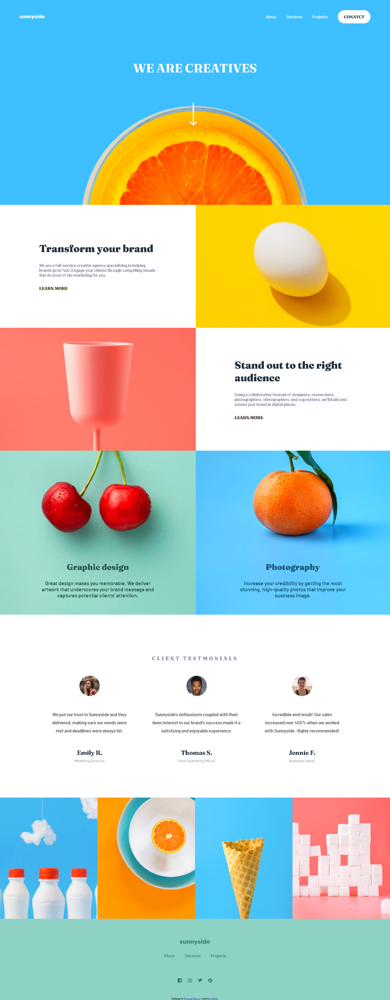
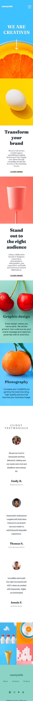

# Frontend Mentor - Sunnyside agency landing page solution

This is a solution to the [Sunnyside agency landing page challenge on Frontend Mentor](https://www.frontendmentor.io/challenges/sunnyside-agency-landing-page-7yVs3B6ef). Frontend Mentor challenges help you improve your coding skills by building realistic projects.

## Table of contents

- [Overview](#overview)
  - [Screenshot](#screenshot)
  - [Links](#links)
- [My process](#my-process)
  - [Built with](#built-with)
  - [What I learned](#what-i-learned)
  - [Continued development](#continued-development)
  - [Useful resources](#useful-resources)
- [Author](#author)

## Overview

### Screenshot

### Links

- Solution URL: [Soltion](https://your-solution-url.com)
- Live Site URL: [Live site](https://lakiidev.github.io/Sunnyside-agency-landing-page/)

## My process

### Built with

- Semantic HTML5 markup
- CSS custom properties
- Flexbox
- CSS Grid

### What I learned

In this project I learned how to use css grid layout's which are somewhat specific on mobile devices. I also learned how to change color of SVGs using CSS.

### Continued development

In future project's I would like to work more on sites in which css grid is desirable.

### Useful resources

- [SVG Color](https://css-tricks.com/change-color-of-svg-on-hover/) - This is an amazing article which helped me finally understand how to change color of SVG image. I'd recommend it to anyone still learning this concept.

## Author

- Frontend Mentor - [@LakiiDev](https://www.frontendmentor.io/profile/LakiiDev)
- LinekedIn - [@LakiDev](https://www.linkedin.com/in/laki-dev-73aa70183/?)

**Note: Delete this note and add/remove/edit lines above based on what links you'd like to share.**

